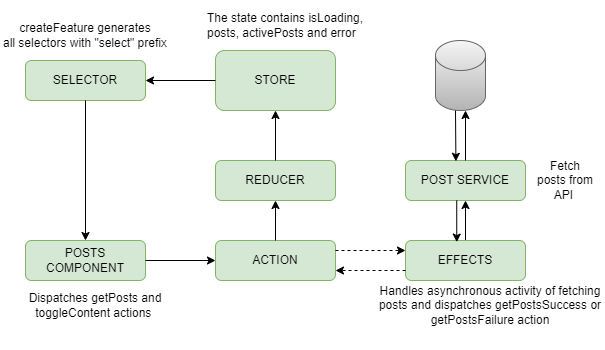

# PostsApp

This Angular application fetch posts and render them as squares.

## Description

The application allows users to click on single post square to change its content. It also resets previous post square to title content as default state.

  * In this project NgRx state management is used to store all posts and active post.
  * It also has Store devtools which makes easier to watch actions and debug state in Chrome's developers tool Redux tab(This is available after adding [Redux Devtools chrome extension](https://chromewebstore.google.com/detail/redux-devtools/lmhkpmbekcpmknklioeibfkpmmfibljd)).
  * Currently only one default route is added to show Posts. In future, additional routes can be added to app.routes.ts.
  * The app also uses scss styling with color variables defined in styles.css
  * This app has few unit tests and e2e tests which covers basic post click functionality.

  Below is the state lifecycle diagram:

  

## Get started

### Clone the repo

```shell
git clone https://github.com/rushikeshchoche/square-posts
cd square-posts
```

### Install npm packages

Install the `npm` packages described in the `package.json` and verify that it works:

```shell
npm install
npm start
```

The `npm start` runs the application with watch mode on port `4200`.

Shut it down manually with `Ctrl+C`.

#### npm scripts

These are the commands defined in `package.json`:

* `npm start` - Runs the app in development mode. Open [http://localhost:4200](http://localhost:4200) to view it in the browser.
* `npm run build` - Builds the app. The build artifacts will be stored in the `dist/` directory.
* `npm run watch` - Builds the app in "watch mode"; when changes occur to source files, they will be recompiled or copied into `dist/`.
* `npm test` - Executes the unit tests via [Jest](https://jestjs.io/).
* `npm run cypress:open` - Opens Cypress Launchpad
* `npm run cypress:run` - Executes the e2e tests.

---
### Answers for the given questions in assignment:

1. The given JWT token has all 3 sections - header, payload and verified signature.

   The payload consists only 3 claims - 'sub', 'admin' and 'valid_until'. However a standard JWT token must have below claims
    * 'iss' - issuer of the JWT
    * 'iat' - issued at
    * 'exp' - expiration time
    * 'aud' - Audience

   So the token is not safe to use as it is missing above claims.

2. Two attack vectors bad actors:

    * Cross Site Scripting XSS - Bad Actors can insert malicious scripts embedded in HTML email content that will be execute when receipent opens their email. To prevent XSS we can do following:
      - Encode HTML tags, Validate inputs.
      - Using content security policy (CSP) - To enable CSP, We can configure our web server to return the Content-Security-Policy HTTP header.

    * Phishing attack - Bad Actors can attempt to steal sensitive information via malware links in email. To prevent phishing:
      - Exercise caution when opening emails or clicking on links, if they seem to be from unknown or external senders.
      - Avoid downloading attachments unless they are from trusted sources or known senders.
      - Add multi-factor authentication to protect accounts from getting hacked.

3. Mutable objects are objects that can be changed after they are created, while immutable are objects that cannot be     changed after creation.
    * Arrays, Objects, functions and dates are mutable in javaScript.
    * All primitive types: strings, numbers, booleans, null and undefined are immutable in javaScript.
    * Object.freeze() creates immutable object in javaScript. This prevent adding, updating or removing existing properties.
    * Pros of using immutable object are: It avoids side effects. This can lead to more predictable code, easier debugging, and better performance.
    * Cons of using immutable object are: It increases memory comsumption. This also affects the garbage collection, which is the process of freeing up memory from unused objects.

    * To achieve immutability
      - We should use const instead of let while creating variables.
      - Should use spread operators to return new objects instead of modifying existing objects.
      - Use array functions that returns new arrays such as map, filter.

4. Steps to speed up the loading of a web-application:
    * Implement lazy loading
    * Optimizing images
    * Code spliting and minifying js and css files
    * Limiting number of HTTP calls on page load
    * Caching static files

5. I feel choosing own hardware provides me flexibility and customization as I can set up my own work environment in a way that suits my preference. This can contribute to increased productivity and efficiency.Using company supplied operating system can ensure standardization across the organization. Software updates, security patches, and configurations can be deployed by IT departments. This will ensure that all devices meet certain security standards and compliance requirements.

---
